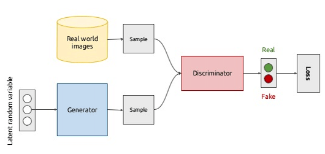
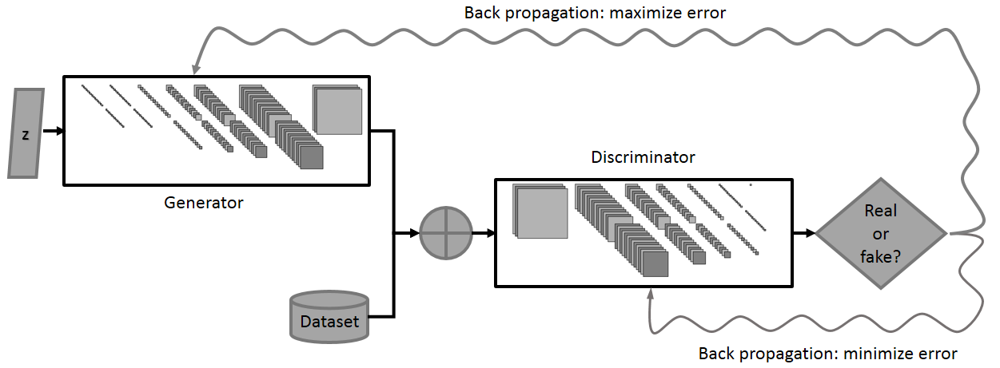

# Some examples of useful GANS

* Sample Concept GAN using y=x^2 distribution
* DCGAN using class implementation - MNIST (number classification)
* Easy to understand GAN - MNIST (number classification)
* [pokeGAN](https://www.youtube.com/watch?v=yz6dNf7X7SA)

Using BC4 for training (do not use your CPU), any other cloud provider e.g. EC2 will suffice also

## Background of GANs

Discriminative learns p(y|x) directly, to learn the boundary between the given classes (is this real or fake).
Generator models p(y),p(x|y) then derives the posterior to learn the distribution via Bayes Rule.

  

When a prediction is made we compute an error value, this allows us to optimize by minimizing the loss function (e.g. using the Gradient Descent Strategy)
GSD computes and updates the gradient values of each network (G & D) which impprove over time, until the disciminator shouldn't be able to tell what's real and what's fake.

Discriminator is a bonary classifier here (real or fake data), so we can assign labels in our network architetcure (Supervised Learning).
When there exists a Supervised Learning Problem one can use Backpropogation. 

  

 
Backpropogation here computes 2 different optimisation problems for the 2 newtorks. Where (as it's adversarial) there are competing against each other to maximise and minimise the error).

A DCGAN (Deep Convolutional) uses convoultional and deconvolutional instead of feed foward networks for G and D. Encouraging the use of batch normalisation, but pooling and fully hidden connected layers are negated.

